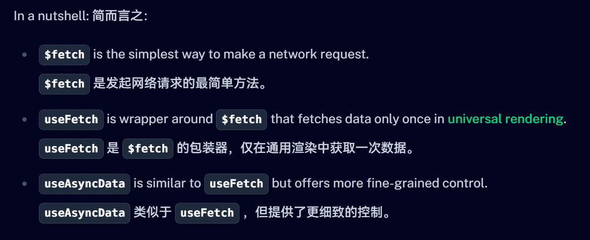

# Nuxt_vue3_ts_pinia

> 一个基于 Nuxt3 + Vue3 + TypeScript + Pinia 的前端框架
>
> 基于个人对react的理解,来学习vue+nuxt的使用
>
> 使用nuxt自带的servie作为一个后端的数据源,看看后期是否添加一下相关内容
>
> 前端ui目前使用antd-vue,后期会使用element-plus
>

## 遇到的问题

- antd-vue在刷新的时候会出现白屏,确切的说是css丢失,目前不知道是什么原因,但是可能是ssr的问题,待研究

  - 解决了大部分的白屏问题，官方是有ssr的相关文档的
  - 解决方法，使用了`@ant-design-vue/nuxt`这个库提供的方法，在里面配置一下就可以了，但是还是会有一些样式丢失的问题，待研究

- ssr在调用的时候需要注意,不要放在`onMounted`里面,不然会出现不调用问题,不能正确的显示我想要的内容
  
## 学习到的内容

### vue相关

- `defineEmits`

    个人理解,这个方法和`defineProps`的区别在于,`defineProps`是用来定义组件的属性,`defineEmits`是用来定义组件的事件

    可以直接用`@`来调用,不像`react`,所有的`props`都是用一个对象来解决的,只需要控制这个对象的`interface`即可

    `vue`里面主要是区分开了`defineProps`和`defineEmits`

   语法:

    ```js
    const emit = defineEmits({
        keyName: keyPropsType
    })
    ```

    用法:

    ```js
    const emit = defineEmits<{
        change: [id: number] 
        update: [value: string]
    }>()
    ```

    约等于:

    ```js
    const emit = defineEmits<{
        (e: 'change', id: number): void
        (e: 'update', value: string): void
    }>()
    ```

- `ref`和`computed`

    `ref`是用来定义一个响应式的变量,`computed`是用来定义一个计算属性

    相比于`react`的`useState`,里面的value比较复杂,不像`react`的`useState`只是一个变量

    包括`computed`也是,总是在不停的`.value`来赋予值和取值,希望后面可以看到有什么方法可以解决

### nuxt相关

- service

    主要是使用了`defineEventHandler`来定义一个请求内容,然后`nuxt`在内部处理了,可以直接使用`useFetch`来获取数据

    但是如果你要是打开了`ssr`,那么就需要注意,不能写在`onMounted`里面,不然会出现不调用的问题

    虽然还没搞懂`useAsyncData`和`$fetch`已经`useFetch`的区别,但是基本上`useFetch`是`$fetch`的一个封装,`useAsyncData`是`useFetch`的一个封装

    
